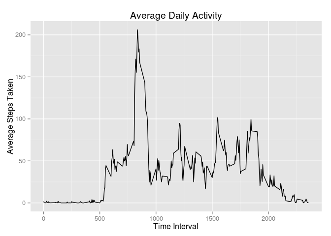

# Reproducible Research: Peer Assessment 1

This analysis assumes the presence of a zipped folder named "activity.zip" that contains activity.csv. It also assumes that the R packages plyr, dplyr, and ggplot2 are installed.  

## Loading and preprocessing the data  
 We start by unzipping activity.zip and loading activity.csv into a variable named activityData.
 

```r
unzip("activity.zip")
activityData <- read.csv("activity.csv",header=TRUE)
```

We also need to load plyr and dplyr for this analysis, and convert our activity data frame to a table to be easier to work with. 


```r
library("plyr")
library("dplyr")
activityData <- tbl_df(activityData)
```


## What is mean total number of steps taken per day?  

For this calculation, we are going to ignore missing values and simply add together all steps across all intervals for every day.   

We start by grouping the activityData table by date and then using the summarize function to add together all steps in a date.  


```r
totalStepsPerDay <- activityData %>% 
    group_by(date) %>%
    summarize(stepsTaken=sum(steps,na.rm=TRUE))
```

This has given us a data frame with one column for dates and another for the sum of all steps on that date. From this point we can examine the distribution of total steps in an interval for the entire timeframe. We will use ggplot2 for this purpose. 


```r
library(ggplot2)
qplot(stepsTaken,data=totalStepsPerDay,
      geom="histogram",
      main="Steps Taken in a Day",
      ylab="Frequency",
      xlab="Steps Taken")
```


We can also calculate the average steps taken per day with a simple mean calculation, removing the NAs. We can pull in the median as well. 


```r
meanSteps <- mean(totalStepsPerDay$stepsTaken,na.rm=TRUE)
medianSteps <- median(totalStepsPerDay$stepsTaken,na.rm=TRUE)
```

And now we know that the mean number of steps taken on days that have data is **9354.2295082** and the median is **10395**.  


## What is the average daily activity pattern?

To look at the behavior of steps taken throughout the day, we will make a time-series plot of all of the intervals in a day and the average of steps taken for every interval across all days.

We will summarize activityData in a similar way as before, except grouping by time interval and summarizing it as an average rather than a sum. Again, for right now we will simply thow out NA values in our mean calculation. 

We then can simply create the time series chart with ggplot2. 


```r
averageIntervalSteps <- activityData %>%
    group_by(interval) %>% 
    summarize(averageSteps=mean(steps,na.rm=TRUE))  

qplot(interval,averageSteps,
      data=averageIntervalSteps,
      geom="line",main="Average Daily Activity",
      ylab="Average Steps Taken",
      xlab="Time Interval")
```



And we can find the interval with the maximum average number of steps as well.

```r
maxInterval <- averageIntervalSteps[which.max(averageIntervalSteps$averageSteps),]
interval <- maxInterval$interval
steps <- maxInterval$averageSteps
```

The time interval with the largest average steps taken is **835** with 
**206.1698113** steps taken during it on average.


## Imputing missing values

Now we will handle the missing data. We will replace each missing value with the median value of the corrosponding time interval. 

First we look at the NAs themselves.

```r
isStepNA <- activityData[is.na(activityData$steps),]
numNAs <- nrow(isStepNA)
```
We have **2304** missing values in our original data. 

Now we find the median value of steps taken for all intervals as we did for the average number of steps, and join the result to the data frame we created of only those rows with NA values. Then we select only the columns we need. I will

```r
medianIntervalSteps <-activityData %>% group_by(interval) %>% summarize(medSteps=median(steps,na.rm=TRUE))
replacedNAs <- join(medianIntervalSteps,isStepNA,by="interval")
replacedNAs <- select(replacedNAs, steps=medSteps, date=date,interval=interval)
```

What we are left with looks like this:

```r
head(replacedNAs)
```

```
##   steps       date interval
## 1     0 2012-10-01        0
## 2     0 2012-10-08        0
## 3     0 2012-11-01        0
## 4     0 2012-11-04        0
## 5     0 2012-11-09        0
## 6     0 2012-11-10        0
```

The only thing that is left to create a version of our original activityData table is to pull out the rows that had step values and combine those with the ones we have doctored. 

```r
isStepNotNA <- activityData[!is.na(activityData$steps),]
activityDataFinal <- rbind(isStepNotNA,replacedNAs)
```

We can now re-create the histogram, median value, and mean value for total steps taken in a day that we did without NA values. 


```r
totalStepsPerDayNoNA <- activityDataFinal %>% 
    group_by(date) %>%
    summarize(stepsTaken=sum(steps,na.rm=TRUE))

meanStepsNoNA <- mean(totalStepsPerDayNoNA$stepsTaken,na.rm=TRUE)
medianStepsNoNA <- median(totalStepsPerDayNoNA$stepsTaken,na.rm=TRUE)

qplot(stepsTaken,data=totalStepsPerDayNoNA,
      geom="histogram",
      main="Steps Taken in a Day",
      ylab="Frequency",
      xlab="Steps Taken")
```


The average steps taken in a day is now **9503.8688525** steps, and the median value is now **10395** steps.

## Are there differences in activity patterns between weekdays and weekends?

To answer this, we need to create a new factor column in our main data table. We can convert the existing date column to POSIX value and find what day of the week it was, and based on that, sort the days into weekends and weekdays.

```r
activityDataFinal <- activityDataFinal %>% 
    mutate(
        day = weekdays(as.POSIXlt(activityDataFinal$date)),
        weekend = as.factor(ifelse(day %in% c("Sunday","Saturday"),"Weekend","Weekday"))
        )
```

To graph this we then need to group by both Weekend/Weekday and interval, summarize the steps taken, and plot similarly to the charts above.


```r
summarizedWeekInterval <- activityDataFinal %>% 
    group_by(weekend,interval) %>%
    summarise(averageSteps = mean(steps))


qplot(interval,averageSteps,data=summarizedWeekInterval,
      facets=weekend~.,
      geom="line",
      main="Average Daily Activity on Weekends and Weekdays",
      ylab="Average Steps Taken",
      xlab="Time Interval")
```


